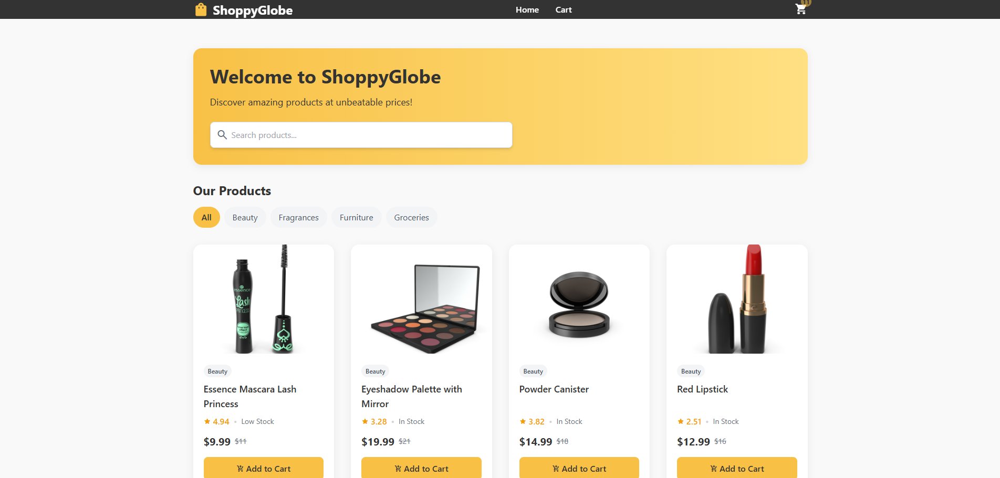

# ShoppyGlobe - Modern E-commerce App

ShoppyGlobe is a sleek, responsive e-commerce application built with React and Redux, featuring a modern UI with Tailwind CSS.



## Features

- **Modern UI with Tailwind CSS**: Clean and responsive design with animations
- **Product Catalog**: Browse through a wide range of products
- **Product Details**: View detailed information about each product
- **Shopping Cart**: Add products to cart, update quantities, or remove items
- **User Authentication**: Sign up, login, and manage your profile
- **Checkout Process**: Streamlined checkout experience
- **Search Functionality**: Find products quickly with search
- **Responsive Design**: Works perfectly on all devices - mobile, tablet, and desktop

## Tech Stack

- **Frontend**: React.js, Redux Toolkit
- **Styling**: Tailwind CSS
- **Routing**: React Router
- **API**: Integrated with DummyJSON API
- **State Management**: Redux with Redux Toolkit
- **Animations**: CSS transitions and Tailwind animations

## Getting Started

### Prerequisites

- Node.js (v14.0.0 or later)
- npm or yarn

### Installation

1. Clone the repository:
   ```bash
   git clone https://github.com/hrishabh1008/ShoppyGlobe-e-commerce-.git
   cd shoppyglobe
   ```

2. Install dependencies:
   ```bash
   npm install
   # or
   yarn install
   ```

3. Start the development server:
   ```bash
   npm start
   # or
   yarn start
   ```

4. Open your browser and visit `http://localhost:3000`

## Project Structure

```
src/
├── components/        # UI components
├── pages/             # Page components
├── redux/             # Redux store, slices, and actions
├── services/          # API services
├── utils/             # Utility functions
├── App.js             # Main application component
└── index.js           # Application entry point
```

## Customization

- **Tailwind Configuration**: Modify `tailwind.config.js` to customize the theme
- **Fonts**: Update fonts in the CSS and Tailwind config
- **Colors**: Adjust the color scheme in the Tailwind config

## Contributing

Contributions are welcome! Please feel free to submit a Pull Request.

## License

This project is licensed under the MIT License - see the LICENSE file for details.

## Acknowledgments

- [DummyJSON](https://dummyjson.com/) for the product API
- [Tailwind CSS](https://tailwindcss.com/) for the styling framework
- [React](https://reactjs.org/) and [Redux](https://redux.js.org/) for the frontend architecture 